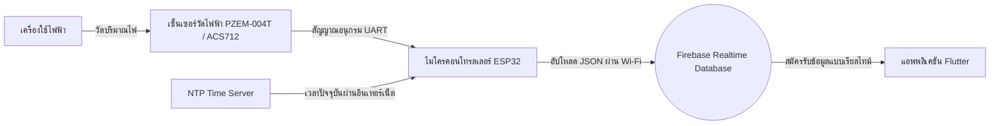
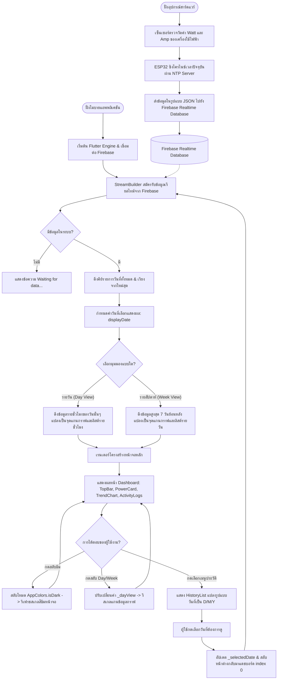

# บทที่ 3 วิธีดำเนินการวิจัย (Methodology)

การดำเนินการวิจัยและพัฒนาระบบเริ่มต้นตั้งแต่การออกแบบส่วนฮาร์ดแวร์เพื่อตรวจวัดค่าพลังงานไฟฟ้าและจัดส่งข้อมูลขึ้นสู่ระบบคลาวด์ ตลอดจนการพัฒนาส่วนหน้าจอแสดงผลบนโมบายแอพพลิเคชันเพื่อการติดตามผลแบบเรียลไทม์ โดยแบ่งรายละเอียดการทำงานออกเป็นส่วนต่าง ๆ ดังนี้:

---

### 3.1 ส่วนการทำงานและรายละเอียดอุปกรณ์ฮาร์ดแวร์ (Hardware Details and Specifications)

การตรวจวัดปริมาณกระแสไฟฟ้าและกำลังไฟฟ้าจริงจำต้องอาศัยฮาร์ดแวร์ (Hardware Core) ที่มีความแม่นยำสูง เชื่อมต่อผ่านระบบเซ็นเซอร์และการประมวลผลของไมโครคอนโทรลเลอร์ โดยมีรายละเอียดโครงสร้างอุปกรณ์ดังนี้:

#### 3.1.1 ส่วนประมวลผลหลัก (Microcontroller Unit - MCU)
* **ESP32 DevKit V1 (30-pin Board)**:
  * สมองกลควบคุมหลัก (Main Controller) ใช้สถาปัตยกรรมชิป Tensilica Dual-Core 32-bit LX6 ความเร็วสัญญาณนาฬิกา 240 MHz
  * มีหน่วยความจำ SRAM ขนาด 520 KB และ Flash Memory ในตัวบอร์ดขนาด 4 MB
  * รองรับการเชื่อมต่อเครือข่ายอินเทอร์เน็ตผ่านโมดูล Wi-Fi (802.11 b/g/n) ย่านความถี่ 2.4 GHz ในตัว ทำให้สามารถรับส่งข้อมูลกับระบบ Firebase ได้อย่างต่อเนื่องและเสถียร

#### 3.1.2 โมดูลตรวจวัดค่าพลังงานไฟฟ้า (Electrical Power Monitoring Module)
* **PZEM-004T v3.0 (AC Power Meter)** ร่วมกับ **Split-Core Current Transformer (CT)**:
  * ทำหน้าที่วัดค่าทางฟิสิกส์ไฟฟ้ากระแสสลับ (AC Single Phase) มีช่วงวัดแรงดันไฟ (Voltage) ตั้งแต่ 80 V ถึง 260 V และกระแสไฟฟ้าสูงสุดไม่เกิน 100A
  * สามารถอ่านค่าพารามิเตอร์ไฟฟ้าที่สำคัญได้ครบถ้วน ได้แก่ แรงดันไฟฟ้า (Voltage: V), กระแสไฟฟ้า (Current: A), กำลังไฟฟ้าจริง (Active Power: W), พลังงานไฟฟ้ารวม (Energy: Wh), ความถี่กระแสไฟ (Frequency: Hz), และค่าตัวประกอบกำลัง (Power Factor)
  * ทำการสื่อสารผ่านโปรโตคอล **UART (Serial Communications)** ด้วยคำสั่ง Modbus-RTU เชื่อมเข้าหาบอร์ด ESP32 เพื่อส่งต่อข้อมูลพารามิเตอร์
* *หมายเหตุ: ในบางรุ่นการติดตั้ง อาจใช้ตัวตรวจจับกระแสไฟแบบอื่นทดแทน อาทิเช่น เซ็นเซอร์กระแสไฟฟ้าแบบสัมผัสโดยตรง **ACS712** (พิกัด 5A / 20A / 30A) หรือ CT Sensor รุ่น **SCT-013-000** ซึ่งเป็นแบบคลิปหนีบสายไฟโดยไม่ต้องตัดต่อสายไฟ (Non-invasive Current Transformer)*

#### 3.1.3 ระบบแปลงจ่ายไฟเลี้ยงหลัก (AC-DC Power Supply Module)
* **HLK-PM01 (5V / 3W)**:
  * เป็นโมดูลสวิตชิ่งแปลงกระแสไฟสลับ 220V AC ลงมาเป็น 5V DC (กระแสตรง) สำหรับเลี้ยงการทำงานของบอร์ดพัฒนา ESP32 และวงจรโมดูล PZEM-004T เพื่อให้ระบบฮาร์ดแวร์ทั้งหมดทำงานได้โดยไม่ต้องต่อสายไฟเลี้ยง USB จากคอมพิวเตอร์ภายนอกตลอดเวลา

---

### 3.2 ขั้นตอนการรับส่งข้อมูลทางกายภาพและระบบคลาวด์ (Data Transmission Flow)

1. **การวัดสัญญาณทางไฟฟ้า (Electrical Sensor Measurement)**:
   * อุปกรณ์เซ็นเซอร์ PZEM-004T วัดกระแสไฟและกำลังไฟฟ้าของเครื่องใช้ไฟฟ้าที่เชื่อมโยงอยู่ จากนั้นส่งผ่านสัญญาณอนุกรมไปยัง ESP32
2. **การซิงโครไนซ์เวลาและจัดแพ็กเกจ (NTP Synchronization & JSON Packaging)**:
   * ไมโครคอนโทรลเลอร์ ESP32 เชื่อมต่อกับเครือข่ายอินเทอร์เน็ตไร้สาย ซิงโครไนซ์เวลาปัจจุบันผ่านโปรโตคอล **NTP (Network Time Protocol)** จากเซิร์ฟเวอร์เวลา NTP ในประเทศ (เช่น `pool.ntp.org` หรือ `time.uni.net.th`) เพื่อหาคีย์ วันที่ปัจจุบัน (YYYY-MM-DD) และชั่วโมงปัจจุบัน (HH)
   * แปลงค่ากำลังไฟฟ้า (วัตต์) และกระแสไฟฟ้า (แอมป์) ออกมาอยู่ในรูปโครงสร้าง **JSON Object**:
     ```json
     {
       "watt": 120.5,
       "amp": 1.25
     }
     ```
3. **การส่งขึ้น Firebase (Data Upload)**:
   * อัปโหลดไฟล์ข้อความ JSON ขึ้นสู่ระบบคลาวด์คิวรี **Firebase Realtime Database** ที่โหนดย่อยเฉพาะตามวันเวลาจริง: `history/YYYY-MM-DD/HH`



---

### 3.3 โครงสร้างข้อมูลบนคลาวด์ (Firebase Realtime Database Schema)

การจัดเก็บข้อมูลบนฐานข้อมูลระบบคลาวด์ของ Firebase ออกแบบโครงสร้างในลักษณะลำดับชั้น **JSON Tree** ภายใต้ URL หลักของโครงการ `https://projectga-d3f20-default-rtdb.asia-southeast1.firebasedatabase.app/` เพื่อรองรับการสืบค้นข้อมูลตามวันเวลาและรองรับการดึงข้อมูลแบบสตรีมมิ่ง โดยมีรายละเอียดโครงสร้างข้อมูลดังนี้:

* **โหนดหลัก (Root Node)**: `history`
  * เป็นสารบัญหลักที่ใช้เก็บบันทึกประวัติพลังงานทั้งหมดของระบบ
* **โหนดวันที่ (Date Key)**: `YYYY-MM-DD` (เช่น `2026-05-30`, `2026-06-01`)
  * โหนดระดับที่สองใช้รูปแบบ วันที่ปัจจุบัน คั่นด้วยเครื่องหมายลบ เพื่อแยกแยะประวัติการใช้ไฟฟ้าในแต่ละวัน ทำหน้าที่เป็นดัชนี (Index) สำหรับคัดกรองวันที่ต้องการสืบค้นย้อนหลัง
* **โหนดชั่วโมง (Hour Key)**: `HH` (ช่วงค่าตัวเลขระหว่าง `0` ถึง `23` เช่น `8`, `10`)
  * โหนดระดับที่สามแยกแยะเวลาเป็นรายชั่วโมง โดยตัดเลข 0 ที่อยู่ข้างหน้าออก (เช่น ชั่วโมงที่ 8 ใช้ชื่อคีย์ `8` แทน `08`) เพื่อความกะทัดรัดของคีย์และสะดวกต่อการแปลงค่าตัวแปรในโปรแกรมซอฟต์แวร์
* **ฟิลด์ข้อมูลพารามิเตอร์พลังงานไฟฟ้า (Data Fields)**:
  * `amp`: ค่ากระแสไฟฟ้าเฉลี่ยในชั่วโมงนั้น (ชนิดข้อมูล: ทศนิยม Double, หน่วย: Ampere: A)
  * `watt`: ค่ากำลังไฟฟ้าจริงที่ใช้งานในชั่วโมงนั้น (ชนิดข้อมูล: จำนวนเต็ม/ทศนิยม, หน่วย: Watt: W)

#### ตัวอย่างโครงสร้างข้อมูล JSON ที่จัดเก็บจริงใน Firebase Realtime Database:
```json
{
  "history": {
    "2026-05-30": {
      "8": {
        "amp": 5.5,
        "watt": 150
      },
      "10": {
        "amp": 4.8,
        "watt": 120
      }
    },
    "2026-06-01": {
      "9": {
        "amp": 6.2,
        "watt": 180
      }
    },
    "2026-06-02": {
      "14": {
        "amp": 5.0,
        "watt": 135
      }
    }
  }
}
```

---

### 3.4 แผนผังการใช้งานระบบ (Use Case Diagram)

แผนผังแสดงสถานะและบทบาทการใช้งานแอปพลิเคชัน (Use Case Diagram) แยกตามผู้เกี่ยวข้องในระบบ (Actors) ได้แก่ **ผู้ใช้งานแอปพลิเคชัน (App User)** และ **อุปกรณ์ฮาร์ดแวร์ไอโอที (ESP32 Board)** ร่วมกับฐานข้อมูล:


```mermaid
leftToRightDirection
actor User as "ผู้ใช้งาน (App User)"
actor Hardware as "อุปกรณ์ฮาร์ดแวร์ (ESP32)"
actor Firebase as "ฐานข้อมูล (Firebase DB)"

rectangle "ระบบติดตามพลังงานไฟฟ้า (Energy Monitor System)" {
    usecase UC1 as "ดูสถานะกำลังไฟฟ้าและกระแสไฟฟ้าแบบเรียลไทม์"
    usecase UC2 as "สลับมุมมองแนวโน้มรายวัน/รายสัปดาห์"
    usecase UC3 as "ดูและค้นหารายการประวัติย้อนหลังตามวันที่"
    usecase UC4 as "สลับโหมดสีการแสดงผล (Dark/Light Theme)"
    usecase UC5 as "วัดกระแสไฟและกำลังไฟฟ้าเครื่องใช้ไฟฟ้า"
    usecase UC6 as "ส่งข้อมูลการใช้ไฟขึ้นระบบคลาวด์แบบเรียลไทม์"
}

User --> UC1
User --> UC2
User --> UC3
User --> UC4

Hardware --> UC5
Hardware --> UC6

UC6 --> Firebase
Firebase -.-> UC1
Firebase -.-> UC3
```

---

### 3.5 แผนผังแสดงขั้นตอนการทำงานของระบบ (Application Working Flowchart)

แผนผังขั้นตอนการทำงาน (Flowchart) ต่อไปนี้แสดงขั้นตอนการทำงานทั้งหมดของระบบ ตั้งแต่จุดเริ่มต้นฝั่งฮาร์ดแวร์ การส่งข้อมูล ตลอดจนระบบแสดงผลและการโต้ตอบในตัวแอปพลิเคชัน:




---

### 3.6 โครงสร้างและการจัดวางหน้าจอหลัก (Main Screen Architecture)

โครงสร้างหน้าจอถูกควบคุมโดยคลาส [WattDashboardPage](file:///c:/ProjectFlutter/projectGA/flutter_app_ga/lib/graph_page.dart) ซึ่งเป็น `StatefulWidget` ทำหน้าที่เป็นผู้ประสานงานหลักในการจัดโครงสร้างหน้าและการสลับมุมมองระหว่าง **หน้าหลัก (Dashboard)** และ **หน้าประวัติ (History List)** โดยใช้โครงร่างโครงสร้างแบบชั้น (Layered Layout) ร่วมกับ `Scaffold` ดังนี้:

1. **ส่วนบน (TopBar)**: แสดงโลโก้ ชื่อแอพพลิเคชัน (Energy Monitor) และปุ่มเปลี่ยนโหมดกลางคืน (Dark Mode Toggle)
2. **ส่วนกลาง (Body)**: เปลี่ยนมุมมองตามแท็บนำทางที่เลือก (Navigation Index):
   * **Dashboard View**: แสดงแผงควบคุมหลัก ได้แก่ การ์ดกำลังไฟฟ้าแบบเรียลไทม์ กราฟเส้นแนวโน้มการใช้ไฟ และตารางประวัติกิจกรรมชั่วโมงต่อชั่วโมง
   * **History View**: แสดงรายการประวัติวันที่สามารถเลือกดูย้อนหลังได้ โดยดึงข้อมูลจาก Firebase Realtime Database
3. **ส่วนล่าง (BottomNav)**: แถบนำทางด้านล่างสำหรับการสลับมุมมองระหว่าง หน้าหลัก (หน้าแรก) และ ประวัติ

---

### 3.7 รายละเอียดการทำงานและการเชื่อมต่อส่วนเก็บข้อมูลหลัก (Core Integration)

#### 3.7.1 การเริ่มต้นระบบและการเชื่อมต่อ Firebase (Firebase Initialization)
แอพพลิเคชันจะเริ่มต้นสถาปัตยกรรมผ่านฟังก์ชันหลัก `main()` ในไฟล์ [main.dart](file:///c:/ProjectFlutter/projectGA/flutter_app_ga/lib/main.dart) โดยทำการเริ่มต้นการเชื่อมต่อแบบอะซิงโครนัส (Asynchronous) เข้ากับ Firebase เพื่อเตรียมความพร้อมสำหรับการทำ Data Streaming:

```dart
// โค้ดส่วนการเริ่มต้นระบบและการเชื่อมต่อกับ Firebase (main.dart)
void main() async {
  WidgetsFlutterBinding.ensureInitialized();
  await Firebase.initializeApp(
    options: DefaultFirebaseOptions.currentPlatform,
  );
  runApp(const MyApp());
}
```

#### 3.7.2 การดึงข้อมูลและเชื่อมโยงข้อมูลแบบเรียลไทม์ (Firebase Realtime Stream Integration)
ระบบใช้โครงสร้าง `StreamBuilder` ในคลาส [WattDashboardPage](file:///c:/ProjectFlutter/projectGA/flutter_app_ga/lib/graph_page.dart) เพื่อสมัครรับข้อมูล (Subscribe) จากตำแหน่ง `history` บน Firebase Realtime Database ทำให้หน้าจอแอพพลิเคชันสามารถรีเรนเดอร์ตัวเองใหม่โดยอัตโนมัติทันทีที่มีการเปลี่ยนแปลงข้อมูลจากฝั่งฮาร์ดแวร์:

```dart
// โค้ดส่วนดึงข้อมูลประวัติและค่าเรียลไทม์จาก Firebase Realtime Database (graph_page.dart)
class _WattDashboardPageState extends State<WattDashboardPage> {
  // การกำหนดตำแหน่งอ้างอิงของโฟลเดอร์ใน Database
  final DatabaseReference _historyRef = FirebaseDatabase.instance.ref('history');

  @override
  Widget build(BuildContext context) {
    return Scaffold(
      backgroundColor: AppColors.bg,
      body: SafeArea(
        child: StreamBuilder(
          stream: _historyRef.onValue, // เชื่อมโยง Stream จาก Firebase
          builder: (context, snapshot) {
            // เมื่อได้รับข้อมูลจาก Firebase สำเร็จ
            if (snapshot.hasData && snapshot.data!.snapshot.value != null) {
              final raw = snapshot.data!.snapshot.value as Map;
              
              // ดึงคีย์ข้อมูลวันที่ทั้งหมดเพื่อแสดงผลในรายการประวัติ
              availableDates = raw.keys.map((e) => e.toString()).toList();
              availableDates.sort((a, b) => b.compareTo(a)); // เรียงลำดับวันล่าสุดขึ้นก่อน
              
              // ... ขั้นตอนการคำนวณและแปลงค่ากำลังไฟฟ้าเพื่อส่งต่อไปยัง Widget อื่น ๆ ...
            }
            // ...
          },
        ),
      ),
    );
  }
}
```

---

### 3.8 รายละเอียดการออกแบบและโครงสร้างโค้ดของวิดเจ็ตย่อย (UI Component Breakdown)

#### 3.8.1 [TopBar (แถบเมนูด้านบน)](file:///c:/ProjectFlutter/projectGA/flutter_app_ga/lib/widgets/top_bar.dart)
ทำหน้าที่แสดงชื่อระบบและสลับสถานะสีธีมผ่านตัวแปร `onToggleTheme` ที่เชื่อมกับสถานะหน้าจอหลัก

#### 3.8.2 [PowerCard (การ์ดแสดงผลค่ากำลังไฟฟ้าหลัก)](file:///c:/ProjectFlutter/projectGA/flutter_app_ga/lib/widgets/power_card.dart)
แสดงค่ากำลังไฟฟ้าหลัก (วัตต์ และ แอมป์) พร้อมระบบแปลงรูปแบบการแสดงผลวันที่ที่กำลังถูกดึงข้อมูลจากค่าเริ่มต้นของเซสชันหรือค่าที่ดึงมาจากฐานข้อมูล:

```dart
// โค้ดส่วนการรับข้อมูลและแปลงแสดงผลการ์ดหลัก (power_card.dart)
class PowerCard extends StatelessWidget {
  final String watt;
  final String amp;
  final String dateStr; // รับค่าวันที่ในรูปแบบ YYYY-MM-DD
  final bool dayView;

  // ...

  @override
  Widget build(BuildContext context) {
    // การแปลงรูปแบบวันที่ YYYY-MM-DD ให้เป็นสากล D/M/Y
    final parts = dateStr.split('-');
    final formattedDate = parts.length == 3 ? '${parts[2]}/${parts[1]}/${parts[0]}' : dateStr;

    return Container(
      // ... การกำหนดสไตล์โครงสร้างการจัดวาง ...
      child: Column(
        children: [
          Text(
            dayView ? formattedDate : 'Last 7 Days', // แสดงวันที่ในฟอร์แทต D/M/Y ที่แปลงแล้ว
            style: TextStyle(fontSize: 11, color: AppColors.textMuted),
          ),
          // ... แสดงค่ากำลังไฟฟ้าและกระแสไฟฟ้า ...
        ],
      ),
    );
  }
}
```

#### 3.8.3 [TrendChart (กราฟแนวโน้มแสดงผลการใช้พลังงาน)](file:///c:/ProjectFlutter/projectGA/flutter_app_ga/lib/widgets/trend_chart.dart)
ใช้โมดูลกราฟของ `fl_chart` ในการแสดงแนวโน้มแบบเส้นเชื่อมความหนา `3.5` และใช้โครงร่างความโปร่งใสแบบไล่โทนสี (Gradient) แสดงผลข้อมูลได้ทั้งแบบ Day (ข้อมูลประชากรชั่วโมงต่อชั่วโมง) และ Week (ข้อมูลประชากรแบบ 7 วันล่าสุด)

#### 3.8.4 [ActivityLogs (ส่วนแสดงประวัติกิจกรรมเชิงลึก)](file:///c:/ProjectFlutter/projectGA/flutter_app_ga/lib/widgets/activity_logs.dart)
มีลอจิกแปลงรูปแบบช่วงวันที่ในการแสดงบันทึกแบบแถวรายการย้อนหลังหากมองผ่านมุมมองรายสัปดาห์:

```dart
// โค้ดส่วนแยกการจัดแสดงผลวันที่กิจกรรมรายวัน (activity_logs.dart)
if (dayView) {
  subStr = '${data.hour.toString().padLeft(2, '0')}:00';
} else {
  final idx = data.hour;
  if (idx >= 0 && idx < weekLabels.length) {
    final parts = weekLabels[idx].split('-');
    // แปลงรูปแบบคีย์ฐานข้อมูล YYYY-MM-DD ในแต่ละจุดแกนข้อมูลให้ออกเป็น D/M/Y
    subStr = parts.length == 3 ? '${parts[2]}/${parts[1]}/${parts[0]}' : weekLabels[idx];
  }
}
```

#### 3.8.5 [HistoryList (ส่วนรายการประวัติการตรวจสอบย้อนหลัง)](file:///c:/ProjectFlutter/projectGA/flutter_app_ga/lib/widgets/history_list.dart)
แสดงรายการคีย์ประวัติวันที่ที่นำมาเรียงเป็นปุ่มกด โดยลอจิกการแปลงรูปแบบจะแปลงก่อนส่งเข้าวาดข้อความเพื่อความสะดวกของมนุษย์ และส่งคีย์ดั้งเดิมกลับไปประมวลผลผ่าน `onDateSelected`:

```dart
// โค้ดส่วนแสดงผลรายการประวัติย้อนหลัง (history_list.dart)
class HistoryList extends StatelessWidget {
  final List<String> dates;
  final String? selectedDate;
  final ValueChanged<String> onDateSelected;

  // ...

  @override
  Widget build(BuildContext context) {
    return ListView.builder(
      itemCount: dates.length,
      itemBuilder: (context, i) {
        final date = dates[i];
        final isSelected = date == (selectedDate ?? (dates.isNotEmpty ? dates.first : ''));
        
        // แยกส่วนคีย์ความปลอดภัย YYYY-MM-DD ออกเป็น D/M/Y
        final parts = date.split('-');
        final formattedDate = parts.length == 3 ? '${parts[2]}/${parts[1]}/${parts[0]}' : date;

        return GestureDetector(
          onTap: () => onDateSelected(date), // ส่งคีย์ดั้งเดิม YYYY-MM-DD กลับไปคิวรี Firebase
          child: Container(
            // ...
            child: Text(
              formattedDate, // แสดงผลวันที่ในหน้าจอเป็น D/M/Y 
              style: TextStyle(
                // ...
              ),
            ),
          ),
        );
      },
    );
  }
}
```
