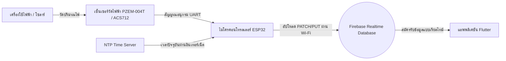
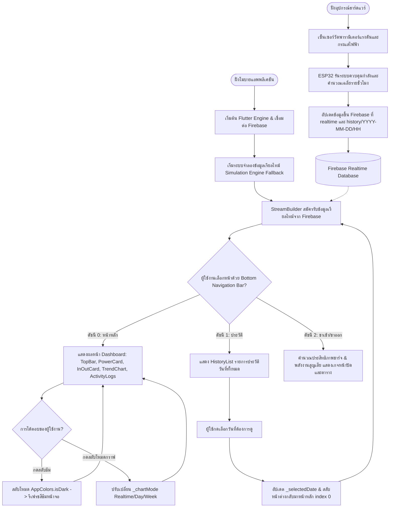

# บทที่ 3 วิธีดำเนินการวิจัย (Methodology)

การดำเนินการวิจัยและพัฒนาระบบเริ่มต้นตั้งแต่การออกแบบส่วนฮาร์ดแวร์เพื่อตรวจวัดค่าพลังงานไฟฟ้าและจัดส่งข้อมูลขึ้นสู่ระบบคลาวด์ ตลอดจนการพัฒนาส่วนหน้าจอแสดงผลบนโมบายแอพพลิเคชันเพื่อการติดตามผลแบบเรียลไทม์ โดยแบ่งรายละเอียดการทำงานออกเป็นส่วนต่าง ๆ ดังนี้:

---

### 3.1 ส่วนการทำงานและรายละเอียดอุปกรณ์ฮาร์ดแวร์ (Hardware Details and Specifications)

การตรวจวัดปริมาณกระแสไฟฟ้าและกำลังไฟฟ้าจริงจำต้องอาศัยฮาร์ดแวร์ (Hardware Core) ที่มีความแม่นยำสูง เชื่อมต่อผ่านระบบเซ็นเซอร์และการประมวลผลของไมโครคอนโทรลเลอร์ โดยตัวบอร์ดคอนโทรลเลอร์จะรองรับการรันเฟิร์มแวร์ระบบชาร์จควบคุม MPPT ทั้งแบบวิธีรบกวนและสังเกต (Perturb and Observe - [PnOmppt.ino](file:///c:/ProjectFlutter/projectGA/hardware/PnOmppt/PnOmppt.ino)) และวิธีกรรมวิธีทางพันธุกรรม (Genetic Algorithm - [Gamppt.ino](file:///c:/ProjectFlutter/projectGA/hardware/Gamppt/Gamppt.ino)) ตามขอบเขตการทดสอบ โดยมีรายละเอียดโครงสร้างอุปกรณ์ดังนี้:

#### 3.1.1 ส่วนประมวลผลหลัก (Microcontroller Unit - MCU)
* **ESP32 DevKit V1 (30-pin Board)**:
  * สมองกลควบคุมหลัก (Main Controller) ใช้สถาปัตยกรรมชิป Tensilica Dual-Core 32-bit LX6 ความเร็วสัญญาณนาฬิกา 240 MHz
  * มีหน่วยความจำ SRAM ขนาด 520 KB และ Flash Memory ในตัวบอร์ดขนาด 4 MB
  * รองรับการเชื่อมต่อเครือข่ายอินเทอร์เน็ตผ่านโมดูล Wi-Fi (802.11 b/g/n) ย่านความถี่ 2.4 GHz ในตัว ทำให้สามารถรับส่งข้อมูลกับระบบ Firebase ได้อย่างต่อเนื่องและเสถียร

#### 3.1.2 โมดูลตรวจวัดค่าพลังงานไฟฟ้า (Electrical Power Monitoring Module)
* **PZEM-004T v3.0 (AC Power Meter)** ร่วมกับ **Split-Core Current Transformer (CT)**:
  * ทำหน้าที่วัดค่าทางฟิสิกส์ไฟฟ้ากระแสสลับ (AC Single Phase) มีช่วงวัดแรงดันไฟ (Voltage) ตั้งแต่ 80 V ถึง 260 V และกระแสไฟฟ้าสูงสุดไม่เกิน 100A
  * สามารถอ่านค่าพารามิเตอร์ไฟฟ้าที่สำคัญได้ครบถ้วน ได้แก่ แรงดันไฟฟ้า (Voltage: V), กระแสไฟฟ้า (Current: A), กำลังไฟฟ้าจริง (Active Power: W), พลังงานไฟฟ้ารวม (Energy: Wh), ความถี่กระแสไฟ (Frequency: Hz), และค่าตัวประกอบกำลัง (Power Factor)
  * ทำการสื่อสารผ่านโปรโตคอล **UART (Serial Communications)** ด้วยคำสั่ง Modbus-RTU เชื่อมเข้าหาบอร์ด ESP32 เพื่อส่งต่อข้อมูลพารามิเตอร์
* *หมายเหตุ: ในบางรุ่นการติดตั้ง อาจใช้ตัวตรวจจับกระแสไฟแบบอื่นทดแทน อาทิเช่น เซ็นเซอร์กระแสไฟฟ้าแบบสัมผัสโดยตรง **ACS712** (พิกัด 5A / 20A / 30A) หรือ CT Sensor รุ่น **SCT-013-000** ซึ่งเป็นแบบคลิปหนีบสายไฟโดยไม่ต้องตัดต่อสายไฟ (Non-invasive Current Transformer)*

#### 3.1.3 ระบบแปลงจ่ายไฟเลี้ยงหลัก (AC-DC Power Supply Module)
* **HLK-PM01 (5V / 3W)**:
  * เป็นโมดูลสวิตชิ่งแปลงกระแสไฟสลับ 220V AC ลงมาเป็น 5V DC (กระแสตรง) สำหรับเลี้ยงการทำงานของบอร์ดพัฒนา ESP32 และวงจรโมดูล PZEM-004T เพื่อให้ระบบฮาร์ดแวร์ทั้งหมดทำงานได้โดยไม่ต้องต่อสายไฟเลี้ยง USB จากคอมพิวเตอร์ภายนอกตลอดเวลา

---

### 3.2 ขั้นตอนการรับส่งข้อมูลทางกายภาพและระบบคลาวด์ (Data Transmission Flow)

การรับส่งข้อมูลพารามิเตอร์ของระบบวัดค่าพลังงานแบ่งออกเป็น 2 ช่องทางหลัก (Dual-Channel Telemetry):
1. **ช่องข้อมูลสดเรียลไทม์ (Real-time Streaming Channel)**: ข้อมูลค่าแรงดันไฟฟ้า กระแสไฟฟ้า และกำลังวัตต์ทันที ณ วินาทีปัจจุบัน ทั้งฝั่งขาเข้าจากแผงโซลาร์เซลล์ (Solar Input: Vin, Iin, Pin) และฝั่งขาออกที่ชาร์จประจุเข้าสู่แบตเตอรี่ (Battery Output: Vout, Iout, Pout) จะถูกอัปเดตอย่างต่อเนื่องเพื่อสะท้อนสถานะการทำงานปัจจุบัน
2. **ช่องข้อมูลเฉลี่ยสะสมรายชั่วโมง (1-Hour Running Average Channel)**: เพื่อป้องกันการจัดเก็บข้อมูลที่หนาแน่นและมีความผันผวนสูง เฟิร์มแวร์บนชิป ESP32 ได้ติดตั้ง **อัลกอริทึมเฉลี่ยสะสมรายชั่วโมง (1-Hour Running Average Algorithm)** โดยบอร์ดจะทำการอ่านค่าพลังงานทุก ๆ 15 วินาที แล้วทำการรวมสะสมค่ากำลังวัตต์และกระแสไฟฟ้าไว้ในหน่วยความจำชั่วคราว จากนั้นทำการหารเฉลี่ยสะสมปัจจุบันยิงอัปโหลดข้อมูลทดแทนที่โหนดของชั่วโมงนั้น ๆ ผ่านเมธอด `HTTP PATCH` และทำการรีเซ็ตตัวแปรเริ่มต้นรอบใหม่เมื่อนาฬิกาของระบบเปลี่ยนผ่านเป็นชั่วโมงถัดไป



---

### 3.3 โครงสร้างข้อมูลบนคลาวด์ (Firebase Realtime Database Schema)

การจัดเก็บข้อมูลบนฐานข้อมูลระบบคลาวด์ของ Firebase ออกแบบโครงสร้างในลักษณะลำดับชั้น **JSON Tree** ภายใต้ URL หลักของโครงการ `https://projectga-d3f20-default-rtdb.asia-southeast1.firebasedatabase.app/` เพื่อรองรับการสืบค้นข้อมูลตามวันเวลาและรองรับการดึงข้อมูลแบบสตรีมมิ่ง โดยมีรายละเอียดโครงสร้างข้อมูลดังนี้:

* **โหนดค่าสดปัจจุบัน (`realtime` Node)**: จัดเก็บพารามิเตอร์พลังงานชั่วขณะสำหรับแสดงทิศทางการไหลและการวิเคราะห์ประสิทธิภาพชาร์จ ประกอบด้วย:
  * `vin`: แรงดันไฟฟ้าขาเข้าจากแผงโซลาร์เซลล์ (หน่วย: V)
  * `iin`: กระแสไฟฟ้าขาเข้าจากแผงโซลาร์เซลล์ (หน่วย: A)
  * `pin`: กำลังไฟฟ้าขาเข้าจากแผงโซลาร์เซลล์ (หน่วย: W)
  * `vout`: แรงดันไฟฟ้าฝั่งจ่ายชาร์จแบตเตอรี่ (หน่วย: V)
  * `iout`: กระแสไฟฟ้าฝั่งจ่ายชาร์จแบตเตอรี่ (หน่วย: A)
  * `pout`: กำลังไฟฟ้าฝั่งจ่ายชาร์จแบตเตอรี่ (หน่วย: W)
* **โหนดประวัติย้อนหลัง (`history` Node)**: โหนดบันทึกประวัติการใช้กำลังไฟฟ้าเฉลี่ยรายชั่วโมงแยกตามวันเวลา โดยมีโครงสร้างย่อยคือ `history/YYYY-MM-DD/HH`:
  * `amp`: ค่ากระแสไฟฟ้าเฉลี่ยในชั่วโมงนั้น (ชนิดข้อมูล: ทศนิยม Double, หน่วย: Ampere: A)
  * `watt`: ค่ากำลังไฟฟ้าเฉลี่ยจริงในชั่วโมงนั้น (ชนิดข้อมูล: จำนวนเต็ม/ทศนิยม, หน่วย: Watt: W)

#### ตัวอย่างโครงสร้างข้อมูล JSON ที่จัดเก็บจริงใน Firebase Realtime Database:
```json
{
  "realtime": {
    "vin": 18.45,
    "iin": 1.22,
    "pin": 22.50,
    "vout": 12.60,
    "iout": 1.60,
    "pout": 20.16
  },
  "history": {
    "2026-06-15": {
      "8": {
        "amp": 1.05,
        "watt": 12.50
      },
      "9": {
        "amp": 1.55,
        "watt": 19.30
      }
    }
  }
}
```

---

### 3.4 แผนผังการใช้งานระบบ (Use Case Diagram)

แผนผังแสดงสถานะและบทบาทการใช้งานแอปพลิเคชัน (Use Case Diagram) แยกตามผู้เกี่ยวข้องในระบบ (Actors) ได้แก่ **ผู้ใช้งานแอปพลิเคชัน (App User)** และ **อุปกรณ์ฮาร์ดแวร์ไอโอที (ESP32 Board)** ร่วมกับฐานข้อมูล:


```mermaid
leftToRightDirection
actor User as "ผู้ใช้งาน (App User)"
actor Hardware as "อุปกรณ์ฮาร์ดแวร์ (ESP32)"
actor Firebase as "ฐานข้อมูล (Firebase DB)"

rectangle "ระบบติดตามพลังงานไฟฟ้า (Energy Monitor System)" {
    usecase UC1 as "ดูสถานะกำลังวัตต์และแผงไหลเวียนพลังงานเรียลไทม์ (Power Flow)"
    usecase UC2 as "วิเคราะห์ประสิทธิภาพการชาร์จ (Efficiency) & กำลังสูญเสีย (Loss)"
    usecase UC3 as "ตรวจสอบโหมดการชาร์จแบตเตอรี่แบบอัตโนมัติ (Bulk/Absorption/Float)"
    usecase UC4 as "สลับแกนพล็อตกราฟแนวโน้ม 3 รูปแบบ (Realtime/Day/Week)"
    usecase UC5 as "ค้นหาและสืบค้นบันทึกประวัติไฟฟ้าตามวันที่"
    usecase UC6 as "สลับโทนสีหน้าต่างแสดงผลกลางคืน (Dark Mode Toggle)"
    usecase UC7 as "วัดประสิทธิภาพพลังงาน & หาจุดทำงานสูงสุด (MPPT Control)"
    usecase UC8 as "อัปโหลดพารามิเตอร์กระแสและวัตต์แบบเฉลี่ยสะสมรายชั่วโมง"
}

User --> UC1
User --> UC2
User --> UC3
User --> UC4
User --> UC5
User --> UC6

Hardware --> UC7
Hardware --> UC8

UC8 --> Firebase
Firebase -.-> UC1
Firebase -.-> UC5
```

---

### 3.5 แผนผังแสดงขั้นตอนการทำงานของระบบ (Application Working Flowchart)

แผนผังขั้นตอนการทำงาน (Flowchart) แสดงโครงสร้างตรรกะการประมวลผลและการนำทางในแอปพลิเคชัน Flutter:




---

### 3.6 โครงสร้างและการจัดวางหน้าจอหลัก (Main Screen Architecture)

โครงสร้างหน้าจอถูกควบคุมโดยคลาส [WattDashboardPage](file:///c:/ProjectFlutter/projectGA/flutter_app_ga/lib/graph_page.dart) ซึ่งเป็น `StatefulWidget` ทำหน้าที่เป็นผู้ประสานงานหลักในการจัดโครงสร้างหน้าและการสลับมุมมองระหว่าง **หน้าหลัก (Dashboard)**, **หน้าประวัติ (History List)** และ **หน้าวิเคราะห์พลังงานละเอียด (In/Out Analysis)** โดยใช้โครงร่างโครงสร้างแบบชั้น (Layered Layout) ร่วมกับ `Scaffold` ดังนี้:

1. **ส่วนบน (TopBar)**: แสดงโลโก้ ชื่อแอพพลิเคชัน (Energy Monitor) และปุ่มเปลี่ยนโหมดกลางคืน (Dark Mode Toggle)
2. **ส่วนกลาง (Body)**: เปลี่ยนมุมมองตามแท็บนำทางที่เลือก (Navigation Index):
   * **Dashboard View (Index 0)**: แสดงแผงควบคุมหลัก ได้แก่ การ์ดกำลังไฟฟ้าเฉลี่ยประจำวัน การ์ดอัตราการไหลของกำลังไฟแบบเรียลไทม์ (InOutCard) กราฟเส้นแนวโน้มแบบสลับได้ 3 โหมด และตารางประวัติกิจกรรมชั่วโมงต่อชั่วโมง
   * **History View (Index 1)**: แสดงรายการประวัติวันที่สามารถเลือกดูย้อนหลังได้ โดยดึงข้อมูลจาก Firebase Realtime Database
   * **In/Out Analysis View (Index 2)**: หน้าจอวิเคราะห์ความสมดุลของการแปลงกำลังไฟฟ้า แสดงเกจประสิทธิภาพการประจุไฟ (Efficiency %) กำลังไฟฟ้าสูญเสีย (Power Loss) ขั้นตอนโหมดการชาร์จแบตเตอรี่ และตารางรายละเอียดพารามิเตอร์แผงและแบตเตอรี่
3. **ส่วนล่าง (BottomNav)**: แถบนำทางด้านล่างสำหรับการสลับมุมมองระหว่าง 3 หน้าต่างย่อยดังกล่าว

---

### 3.7 รายละเอียดการทำงานและการเชื่อมต่อส่วนเก็บข้อมูลหลัก (Core Integration)

#### 3.7.1 การเริ่มต้นระบบและการเชื่อมต่อ Firebase (Firebase Initialization)
แอพพลิเคชันจะเริ่มต้นสถาปัตยกรรมผ่านฟังก์ชันหลัก `main()` ในไฟล์ [main.dart](file:///c:/ProjectFlutter/projectGA/flutter_app_ga/lib/main.dart) โดยทำการเริ่มต้นการเชื่อมต่อแบบอะซิงโครนัส (Asynchronous) เข้ากับ Firebase เพื่อเตรียมความพร้อมสำหรับการทำ Data Streaming:

```dart
// โค้ดส่วนการเริ่มต้นระบบและการเชื่อมต่อกับ Firebase (main.dart)
void main() async {
  WidgetsFlutterBinding.ensureInitialized();
  await Firebase.initializeApp(
    options: DefaultFirebaseOptions.currentPlatform,
  );
  runApp(const MyApp());
}
```

#### 3.7.2 ระบบจำลองข้อมูลแบบเรียลไทม์ (Simulation Engine Fallback & Telemetry Integration)
ภายในคลาส [_WattDashboardPageState](file:///c:/ProjectFlutter/projectGA/flutter_app_ga/lib/graph_page.dart) มีการตั้งตัวจับเวลาเพื่อจำลองข้อมูลแบบเรียลไทม์ขึ้นมาแสดงผลทดแทนอัตโนมัติ ในกรณีที่สัญญาณเชื่อมต่อกับบอร์ดขาดหาย เพื่อป้องกันการค้างของ UI และสร้างความลื่นไหลของพารามิเตอร์พลังงาน:

```dart
// โค้ดส่วนระบบจำลองและควบคุมตัวแปรทางฟิสิกส์ (graph_page.dart)
void _setupRealtimeData() {
  _simulationTimer = Timer.periodic(const Duration(seconds: 2), (timer) {
    setState(() {
      // ดึงค่ากำลังวัตต์ล่าสุดจากประวัติระบบเพื่อเป็นฐานคำนวณ
      double basePout = _latestHistoryWatt ?? 8.5;
      if (basePout <= 0.1) basePout = 8.5;

      final double randomSec = DateTime.now().second.toDouble();
      final double wave = 0.5 * (1 + (randomSec / 60.0)); // รูปแบบคลื่นสัญญาณจำลอง

      final double randV = (DateTime.now().millisecond % 80 - 40) / 100.0; // ค่าแกว่งแรงดัน +/- 0.4V
      final double randI = (DateTime.now().millisecond % 60 - 30) / 1000.0; // ค่าแกว่งกระแส +/- 0.03A

      // คำนวณพารามิเตอร์ชาร์จขาออกแบตเตอรี่ (Battery Output)
      vout = 12.4 + randV;
      iout = (basePout / vout) * wave + randI;
      if (iout < 0) iout = 0;
      pout = vout * iout;

      // คำนวณพารามิเตอร์แผงขาเข้า (Solar Input) โดยอิงตามสัมประสิทธิ์ประสิทธิภาพชาร์จประมาณ 88%-92%
      vin = 18.2 + randV * 1.5;
      double efficiency = 0.88 + (DateTime.now().millisecond % 5) / 100.0;
      pin = pout / efficiency;
      iin = pin / vin;

      // พล็อตจุดจุดข้อมูลเรียลไทม์ไปยังหน่วยความจำแสดงกราฟเส้น
      _addRealtimePoint(pout);
    });
  });
}
```

---

### 3.8 รายละเอียดการออกแบบและโครงสร้างโค้ดของวิดเจ็ตย่อย (UI Component Breakdown)

#### 3.8.1 [TopBar (แถบเมนูด้านบน)](file:///c:/ProjectFlutter/projectGA/flutter_app_ga/lib/widgets/top_bar.dart)
ทำหน้าที่แสดงชื่อระบบและสลับสถานะสีธีมผ่านตัวแปร `onToggleTheme` ที่เชื่อมกับสถานะหน้าจอหลัก

#### 3.8.2 [PowerCard (การ์ดแสดงผลค่ากำลังไฟฟ้าหลัก)](file:///c:/ProjectFlutter/projectGA/flutter_app_ga/lib/widgets/power_card.dart)
แสดงค่ากำลังไฟฟ้าหลัก (วัตต์ และ แอมป์) พร้อมระบบแปลงรูปแบบการแสดงผลวันที่ที่กำลังถูกดึงข้อมูลจากค่าเริ่มต้นของเซสชันหรือค่าที่ดึงมาจากฐานข้อมูล:

```dart
// โค้ดส่วนการรับข้อมูลและแปลงแสดงผลการ์ดหลัก (power_card.dart)
class PowerCard extends StatelessWidget {
  final String watt;
  final String amp;
  final String dateStr; // รับค่าวันที่ในรูปแบบ YYYY-MM-DD
  final bool dayView;

  // ...

  @override
  Widget build(BuildContext context) {
    // การแปลงรูปแบบวันที่ YYYY-MM-DD ให้เป็นสากล D/M/Y
    final parts = dateStr.split('-');
    final formattedDate = parts.length == 3 ? '${parts[2]}/${parts[1]}/${parts[0]}' : dateStr;

    return Container(
      // ... การกำหนดสไตล์โครงสร้างการจัดวาง ...
      child: Column(
        children: [
          Text(
            dayView ? formattedDate : 'Last 7 Days', // แสดงวันที่ในฟอร์แทต D/M/Y ที่แปลงแล้ว
            style: TextStyle(fontSize: 11, color: AppColors.textMuted),
          ),
          // ... แสดงค่ากำลังไฟฟ้าและกระแสไฟฟ้า ...
        ],
      ),
    );
  }
}
```

#### 3.8.3 [InOutCard (การ์ดเปรียบเทียบการไหลของกำลังไฟ)](file:///c:/ProjectFlutter/projectGA/flutter_app_ga/lib/widgets/in_out_card.dart)
แสดงสตรีมปริมาณการไหลแบบสองช่องขนาน (Solar Input vs Battery Output) บนหน้าแดชบอร์ดหลักเพื่อให้ทราบค่าแรงดัน กระแส และวัตต์ ณ ปัจจุบันในหน้าเดียว:
```dart
// โครงสร้างส่วนเปรียบเทียบข้อมูลเข้าออกเบื้องต้น (in_out_card.dart)
class InOutCard extends StatelessWidget {
  final double vin;
  final double iin;
  final double pin;
  final double vout;
  final double iout;
  final double pout;

  const InOutCard({
    Key? key,
    required this.vin,
    required this.iin,
    required this.pin,
    required this.vout,
    required this.iout,
    required this.pout,
  }) : super(key: key);

  @override
  Widget build(BuildContext context) {
    return Container(
      // ... กำหนดการตกแต่งขอบและกล่องแสงเงา ...
      child: Row(
        children: [
          // ฝั่งขาเข้าแผงโซลาร์
          Expanded(child: _buildColumn('ขาเข้า (Solar Input)', Icons.solar_power_rounded, Colors.amber, vin, iin, pin)),
          // เส้นแบ่งแนวตั้ง
          Container(width: 1, height: 90, color: AppColors.divider),
          // ฝั่งขาออกแบตเตอรี่
          Expanded(child: _buildColumn('ขาออก (Battery Out)', Icons.battery_charging_full_rounded, Colors.green, vout, iout, pout)),
        ],
      ),
    );
  }
}
```

#### 3.8.4 [TrendChart (กราฟแนวโน้มแสดงผลการใช้พลังงาน)](file:///c:/ProjectFlutter/projectGA/flutter_app_ga/lib/widgets/trend_chart.dart)
ใช้โมดูลกราฟของ `fl_chart` ในการแสดงแนวโน้มแบบเส้นเชื่อมความหนา `3.5` และใช้โครงร่างความโปร่งใสแบบไล่โทนสี (Gradient) แสดงผลข้อมูลได้ทั้งแบบ Realtime (ข้อมูลเส้นขยับได้), Day (ข้อมูลประชากรรายชั่วโมง) และ Week (ข้อมูลประชากรสูงสุดย้อนหลัง 7 วัน)

#### 3.8.5 [ActivityLogs (ส่วนแสดงประวัติกิจกรรมเชิงลึก)](file:///c:/ProjectFlutter/projectGA/flutter_app_ga/lib/widgets/activity_logs.dart)
มีลอจิกแปลงรูปแบบช่วงวันที่ในการแสดงบันทึกแบบแถวรายการย้อนหลังหากมองผ่านมุมมองรายสัปดาห์:

```dart
// โค้ดส่วนแยกการจัดแสดงผลวันที่กิจกรรมรายวัน (activity_logs.dart)
if (dayView) {
  subStr = '${data.hour.toString().padLeft(2, '0')}:00';
} else {
  final idx = data.hour;
  if (idx >= 0 && idx < weekLabels.length) {
    final parts = weekLabels[idx].split('-');
    // แปลงรูปแบบคีย์ฐานข้อมูล YYYY-MM-DD ในแต่ละจุดแกนข้อมูลให้ออกเป็น D/M/Y
    subStr = parts.length == 3 ? '${parts[2]}/${parts[1]}/${parts[0]}' : weekLabels[idx];
  }
}
```

#### 3.8.6 [HistoryList (ส่วนรายการประวัติการตรวจสอบย้อนหลัง)](file:///c:/ProjectFlutter/projectGA/flutter_app_ga/lib/widgets/history_list.dart)
แสดงรายการคีย์ประวัติวันที่ที่นำมาเรียงเป็นปุ่มกด โดยลอจิกการแปลงรูปแบบจะแปลงก่อนส่งเข้าวาดข้อความเพื่อความสะดวกของมนุษย์ และส่งคีย์ดั้งเดิมกลับไปประมวลผลผ่าน `onDateSelected` เพื่อคิวรีคลาวด์

#### 3.8.7 [InOutPage (ส่วนหน้าจอวิเคราะห์สมดุลประสิทธิภาพพลังงาน)](file:///c:/ProjectFlutter/projectGA/flutter_app_ga/lib/in_out_page.dart)
วิดเจ็ตหน้าแยกเฉพาะในการติดตามประสิทธิภาพการประจุพลังงานและการสูญเสียกำลังไฟฟ้าตามสมการและลอจิกการทำงานดังนี้:

* **ประสิทธิภาพการชาร์จ (Charging Efficiency)**:
  $$\eta = \left( \frac{P_{\text{out}}}{P_{\text{in}}} \right) \times 100\%$$
* **กำลังไฟฟ้าสูญเสียในระบบ (Power Loss)**:
  $$P_{\text{loss}} = P_{\text{in}} - P_{\text{out}}$$
* **การแบ่งจำแนกโหมดการชาร์จแบตเตอรี่แบบอัตโนมัติ (Battery Charge Mode Detection)**:
  * `Bulk Charge` (โหมดชาร์จเร็วประสิทธิภาพสูง): ประสิทธิภาพการชาร์จสูงกว่า 90% และมีกำลังวัตต์ขาเข้า ($P_{\text{in}} > 0.5\text{ W}$)
  * `Absorption Charge` (โหมดชาร์จปกติแรงดันคงที่): ประสิทธิภาพการชาร์จอยู่ระหว่าง 70% ถึง 90%
  * `Float Charge` (โหมดชาร์จประคองประจุ): ประสิทธิภาพการชาร์จต่ำกว่า 70%

```dart
// โค้ดบางส่วนของการคำนวณและประมวลผลสถานะของ InOutPage (in_out_page.dart)
class InOutPage extends StatelessWidget {
  final double vin;
  final double iin;
  final double pin;
  final double vout;
  final double iout;
  final double pout;

  // ...

  @override
  Widget build(BuildContext context) {
    // การคำนวณทางคณิตศาสตร์พลังงาน
    final double efficiency = pin > 0 ? (pout / pin) * 100 : 0.0;
    final double loss = pin > pout ? pin - pout : 0.0;
    final double constrainedEfficiency = efficiency.clamp(0.0, 100.0);

    // ลอจิกวิเคราะห์สถานะขั้นตอนของระบบควบคุม MPPT
    String chargingStatus = 'ระบบไม่ทำงาน';
    Color statusColor = AppColors.textMuted;
    
    if (pin > 0.5) {
      if (efficiency > 90) {
        chargingStatus = 'กำลังชาร์จประสิทธิภาพสูง (Bulk)';
        statusColor = Colors.green;
      } else if (efficiency > 70) {
        chargingStatus = 'กำลังชาร์จปกติ (Absorption)';
        statusColor = AppColors.primary;
      } else {
        chargingStatus = 'ประคองประจุชาร์จ (Float)';
        statusColor = Colors.amber;
      }
    }
    // ... เรนเดอร์หน้าจอพร้อมเกจแสดงผลแบบวงกลมและตารางค่าไฟฟ้าเข้า/ออก ...
  }
}
```
