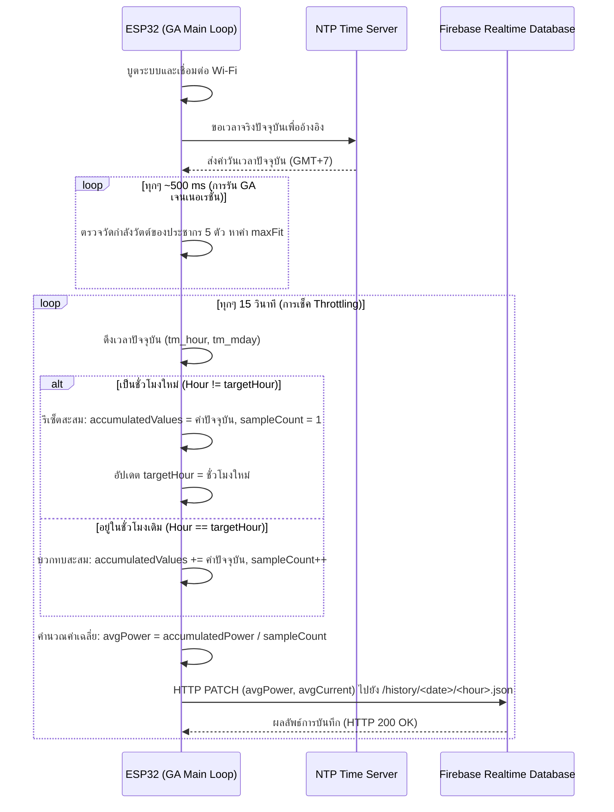

# รายงานโครงสร้างและการทำงานของส่วนส่งข้อมูลเฉลี่ยสะสมไปยัง Firebase (ไฟล์ Gamppt.ino)

เอกสารฉบับนี้อธิบายรายละเอียดซอร์สโค้ดในไฟล์ [Gamppt.ino](file:///c:/ProjectFlutter/projectGA/hardware/Gamppt/Gamppt.ino) เฉพาะส่วนที่เกี่ยวข้องกับการเชื่อมต่อเครือข่าย Wi-Fi, NTP (Network Time Protocol) และอัลกอริทึมการคำนวณ **ค่าเฉลี่ยสะสมรายชั่วโมง (Running Average)** ของกำลังไฟฟ้า (วัตต์) และกระแสไฟฟ้า (แอมป์) แล้วส่งขึ้นไปยัง Firebase Realtime Database ของระบบควบคุม MPPT ด้วยอัลกอริทึมพันธุกรรม (Genetic Algorithm - GA)

---

## 1. ไลบรารีและการกำหนดค่าพื้นฐาน (Libraries & Configuration)

โค้ดนำเข้าไลบรารีมาตรฐานสำหรับจัดการ Wi-Fi, ทำงานกับเว็บเซิร์ฟเวอร์ด้วย HTTP, และการเข้าถึงข้อมูลเวลาปัจจุบัน:

```cpp
#include <Arduino.h>
#include <WiFi.h>          // จัดการการเชื่อมต่อ Wi-Fi ของ ESP32
#include <HTTPClient.h>    // ส่งข้อมูล HTTP Request (GET/POST/PATCH) ไปยัง Firebase
#include <time.h>          // จัดการเวลาด้วยคำสั่ง NTP เพื่อใช้แบ่งไดเรกทอรีข้อมูลตามเวลาจริง
```

### การตั้งค่าการเชื่อมต่อ (Configuration Constants)
ในส่วนบนของโค้ดระบุค่าคงที่สำหรับ Wi-Fi, Firebase และเซิร์ฟเวอร์เวลา NTP:

```cpp
// --- Wi-Fi & Firebase Configuration ---
const char* WIFI_SSID = "YOUR_WIFI_SSID";          // ชื่อ Wi-Fi SSID
const char* WIFI_PASSWORD = "YOUR_WIFI_PASSWORD";  // รหัสผ่าน Wi-Fi
const char* FIREBASE_HOST = "https://projectga-d3f20-default-rtdb.asia-southeast1.firebasedatabase.app"; // URL ของ Firebase RTDB

// --- NTP Time Server ---
const char* ntpServer = "pool.ntp.org";            // ที่อยู่ NTP server หลัก
const long  gmtOffset_sec = 7 * 3600;              // ปรับโซนเวลาเป็นประเทศไทย (GMT+7)
const int   daylightOffset_sec = 0;                // ไม่มี Daylight Saving Time ในไทย
```

---

## 2. โครงสร้างอัลกอริทึมเฉลี่ยสะสมรายชั่วโมง (1-Hour Running Average Algorithm)

เพื่อแก้ปัญหาข้อมูลการวัดที่มีความผันผวนและความถี่ในการส่งที่อาจหนาแน่นเกินไป โค้ดได้เปลี่ยนวิธีการส่งจาก **"ค่าทันที ณ วินาทีนั้น (Instant Values)"** ไปเป็น **"ค่าเฉลี่ยสะสมของชั่วโมงนั้นๆ (1-Hour Running Average)"** โดยทำงานดังนี้:
1. **เก็บตัวอย่างข้อมูลทุกๆ 15 วินาที:** อ่านค่าประสิทธิภาพกำลังวัตต์ที่ดีที่สุดของรอบ GA (`maxFit`) และกระแสไฟฟ้า (`maxFit / vBat`)
2. **สะสมค่า (Accumulation):** นำกำลังวัตต์และแอมป์ที่ได้ไปบวกทบสะสมลงในตัวแปร Global `accumulatedPower` และ `accumulatedCurrent` พร้อมเพิ่มจำนวนตัวอย่าง (`sampleCount`)
3. **หาค่าเฉลี่ยแบบเรียลไทม์ (Running Average Calculation):** คำนวณหาค่าเฉลี่ยสะสมปัจจุบันโดยนำ `ผลรวมสะสม / จำนวนตัวอย่าง`
4. **ส่งอัปเดต Firebase ทุกๆ 15 วินาที:** ส่งค่าเฉลี่ยสะสมปัจจุบันขึ้นไปทับที่ฐานข้อมูลชั่วโมงเดิมผ่าน HTTP PATCH
5. **รีเซ็ตเมื่อเข้าชั่วโมงใหม่ (Hour Transition Reset):** เมื่อนาฬิกาของ ESP32 เปลี่ยนผ่านเป็นชั่วโมงถัดไป (เช่น จาก 14:59 น. ไปเป็น 15:00 น.) ระบบจะทำการรีเซ็ตค่ารวมสะสมและจำนวนตัวอย่างกลับเป็นเริ่มต้น เพื่อคำนวณเฉลี่ยของชั่วโมงใหม่แยกจากชั่วโมงเดิมอย่างถูกต้อง

---

## 3. ตัวแปรและฟังก์ชันที่เพิ่มเข้ามา (Averaging & Network Functions)

### 3.1 ตัวแปร Global สำหรับเก็บค่าสะสม (Averaging Variables)
```cpp
// --- Global variables for 1-hour averaging ---
float accumulatedPower = 0.0;     // เก็บกำลังวัตต์รวมสะสมใน 1 ชั่วโมง
float accumulatedCurrent = 0.0;   // เก็บกระแสแอมป์รวมสะสมใน 1 ชั่วโมง
unsigned int sampleCount = 0;     // จำนวนตัวอย่างที่ถูกอ่านในชั่วโมงนั้น
int targetHour = -1;              // ชั่วโมงที่ใช้อ้างอิงการบันทึก (-1 คือยังไม่ระบุ)
String targetDate = "";           // วันที่ที่ใช้อ้างอิง (รูปแบบ YYYY-MM-DD)
```

### 3.2 ฟังก์ชันส่งข้อมูลด้วย PATCH Request
ฟังก์ชัน `sendDataToFirebase()` จะสร้าง URL ปลายทางแยกรายวันและรายชั่วโมง เช่น `/history/YYYY-MM-DD/HH.json` และส่งข้อมูลไปอัปเดตค่า `watt` และ `amp` ด้วยเมธอด **PATCH** เพื่อให้อัปโหลดทับข้อมูลตัวเก่าในชั่วโมงนั้นๆ โดยไม่กระทบคีย์อื่นๆ ในโครงสร้างเดียวกัน

```cpp
void sendDataToFirebase(float power, float current, String dateStr, int hour) {
  if (WiFi.status() == WL_CONNECTED) {
    HTTPClient http;
    // สร้าง URL ปลายทาง: /history/<วันที่>/<ชั่วโมง>.json
    String url = String(FIREBASE_HOST) + "/history/" + dateStr + "/" + String(hour) + ".json";
    
    http.begin(url);
    http.addHeader("Content-Type", "application/json");

    // จัดเตรียมรูปแบบ JSON: {"watt": XX.XX, "amp": YY.YY}
    String jsonPayload = "{\"watt\":" + String(power, 2) + ",\"amp\":" + String(current, 2) + "}";

    // ส่งแบบ HTTP PATCH เพื่อเขียนอัปเดตค่าล่าสุดในรอบเวลานั้นๆ
    int httpResponseCode = http.PATCH(jsonPayload);
    
    if (httpResponseCode > 0) {
      Serial.printf("[Firebase] Send Success (HTTP %d): %s\n", httpResponseCode, jsonPayload.c_str());
    } else {
      Serial.printf("[Firebase] Send Failed: %s\n", http.errorToString(httpResponseCode).c_str());
    }
    http.end();
  }
}
```

---

## 4. โครงสร้างเวลาและการนับลูปของ GA (Execution Loop Breakdown)

กระบวนการประมวลผลหลักของ Genetic Algorithm (GA) ในการหาค่า MPPT จะวนลูปประชากร 5 ตัว (`POP_SIZE = 5`) และปรับเกต MOSFET ด้วยค่า Duty Cycle จากยีนของประชากรแต่ละตัว โดยมีการดีเลย์รอบละ 100ms เพื่อให้กระแสและแรงดันนิ่งก่อนวัดประสิทธิภาพ ดังนั้น ลูปหลัก 1 รอบ (1 เจนเนอเรชั่นหรือ 1 Step) จะใช้เวลาอย่างน้อย `5 * 100ms = 500ms`

ตัวนับเวลา 15 วินาทีของส่วนบันทึกข้อมูลจะเช็คค่าผ่านคำสั่ง `millis()` แบบ **Non-blocking Throttling** ทำงานร่วมกับลูปหลักดังนี้:

```cpp
  // --- 2. รันอัลกอริทึม GA ---
  if (isRunning) {
    int bestIdx = 0;
    float maxFit = -1;

    // ประเมินประสิทธิภาพของประชากรทีละตัวเพื่อหาค่าที่ดีที่สุด (maxFit)
    for(int i=0; i<POP_SIZE; i++) {
      int duty = binaryToDecimal(population[i]);
      ledcWrite(PWM_PIN, duty);
      delay(100); 
      
      fitness[i] = getPower();
      
      if(fitness[i] > maxFit) {
        maxFit = fitness[i];
        bestIdx = i;
      }
    }

    stepCount++; 
    Serial.print(stepCount); Serial.print(",");
    Serial.println(maxFit, 2); 

    // --- ส่วนเก็บตัวอย่างทุก 15 วินาทีและหาค่าเฉลี่ยสะสมรายชั่วโมง (Running Average) ---
    static unsigned long lastSampleTime = 0;
    if (millis() - lastSampleTime >= 15000) {
      lastSampleTime = millis();
      
      float currentPower = maxFit;        // กำลังไฟฟ้าวัตต์ที่ดีที่สุดของรุ่นปัจจุบัน
      float currentAmp = maxFit / vBat;   // กระแสไฟฟ้าที่แปลงจากวัตต์สูงสุดหารด้วยแรงดันแบตเตอรี่ (12.6V)
      
      struct tm timeinfo;
      if (getLocalTime(&timeinfo)) {
        char dateStr[12];
        strftime(dateStr, sizeof(dateStr), "%Y-%m-%d", &timeinfo);
        int currentHour = timeinfo.tm_hour;
        
        // กำหนดชั่วโมงและวันที่เริ่มต้นในครั้งแรกที่เข้าระบบ
        if (targetHour == -1) {
          targetHour = currentHour;
          targetDate = String(dateStr);
        }
        
        // เมื่อสลับชั่วโมงใหม่ (เช่น จากชั่วโมง 14 ไปยังชั่วโมง 15)
        if (currentHour != targetHour) {
          accumulatedPower = currentPower;
          accumulatedCurrent = currentAmp;
          sampleCount = 1; // เริ่มนับตัวอย่างที่ 1 ของชั่วโมงใหม่
          targetHour = currentHour;
          targetDate = String(dateStr);
        } else {
          // หากอยู่ในชั่วโมงเดียวกัน นำค่าไปบวกสมทบเรื่อยๆ
          accumulatedPower += currentPower;
          accumulatedCurrent += currentAmp;
          sampleCount++;
        }
        
        // คำนวณค่าเฉลี่ยสะสมปัจจุบัน (ผลรวมทั้งหมด / จำนวนตัวอย่างที่ได้ในชั่วโมงนั้น)
        float avgPower = accumulatedPower / sampleCount;
        float avgCurrent = accumulatedCurrent / sampleCount;
        
        // ส่งอัปโหลดค่าเฉลี่ยรายชั่วโมงไปยัง Firebase ทุกๆ 15 วินาที
        sendDataToFirebase(avgPower, avgCurrent, targetDate, targetHour);
      }
    }
```

---

## 5. เปรียบเทียบกับซอร์สโค้ด PnOmppt.ino

| หัวข้อเปรียบเทียบ | โค้ด PnOmppt.ino | โค้ด Gamppt.ino |
|---|---|---|
| **โครงสร้างระบบส่ง** | อัลกอริทึมเฉลี่ยสะสมรายชั่วโมง ส่งทุกๆ 15 วินาที | อัลกอริทึมเฉลี่ยสะสมรายชั่วโมง ส่งทุกๆ 15 วินาที |
| **แหล่งที่มาของวัตต์ (Power)** | ได้จากการวัดค่า ณ วินาทีนั้นโดยตรง (`getPower()`) | ได้จากประสิทธิภาพวัตต์ที่สูงที่สุดของรุ่นประชากร GA (`maxFit`) |
| **ตัวหารกระแสไฟฟ้า (vBat)** | `vBat` เท่ากับ 18.0 V | `vBat` เท่ากับ 12.6 V |
| **ความถี่ของลูปวัดหลัก** | รันเฉลี่ยก้าวละ 1,000ms (ดีเลย์ 10ms ปรับค่าได้) | รันเฉลี่ยรุ่นละ ~500ms (มีดีเลย์ 100ms x 5 ประชากร) |

---

## 6. ลำดับขั้นตอนการทำงาน (Sequence Diagram)


