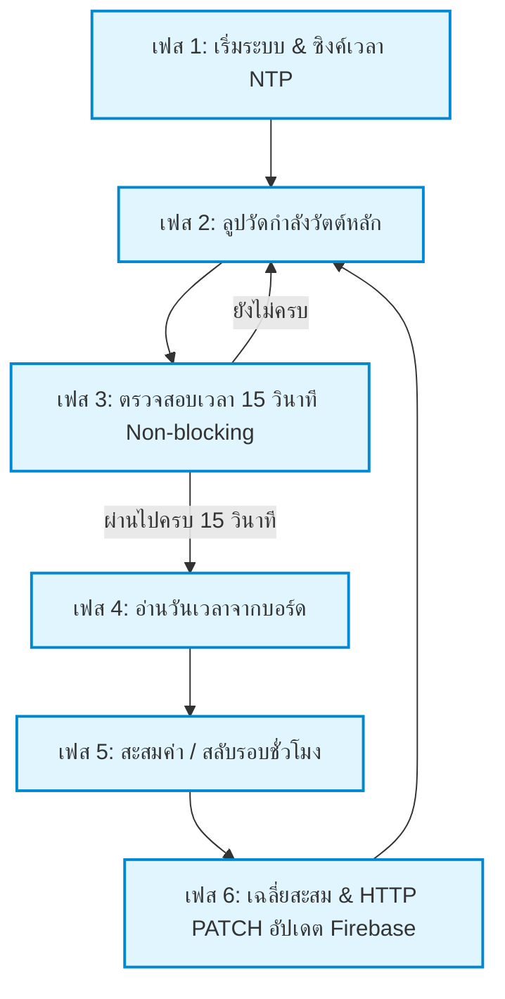
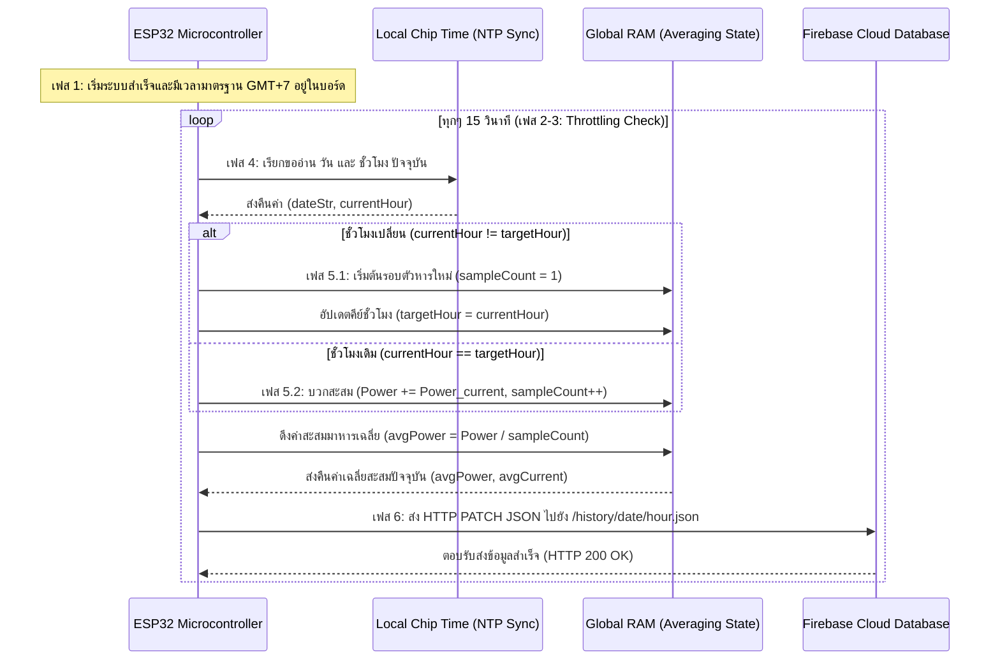

# เอกสารวิเคราะห์ลำดับการทำงาน: ระบบส่งข้อมูลเฉลี่ยสะสมรายชั่วโมงขึ้น Firebase Realtime Database (6-Phase Detailed Walkthrough)

เอกสารฉบับนี้จัดทำขึ้นเพื่อแสดงลำดับขั้นตอนการทำงานโดยละเอียดตั้งแต่เริ่มต้นบูตเครื่องไมโครคอนโทรลเลอร์ ESP32 ตลอดจนกระบวนการจัดเตรียมข้อมูล การสลับตัดรอบชั่วโมง และการจัดส่งข้อมูลอัปโหลดผ่านอินเทอร์เน็ตขึ้นสู่ระบบคลาวด์ Firebase Realtime Database

---

## 1. ลำดับขั้นตอนการประมวลผลระบบย่อย (6-Phase Operation)

การอัปเดตข้อมูลขึ้นระบบคลาวด์ ถูกแบ่งออกเป็น 6 เฟสการทำงานต่อเนื่องที่เป็นอิสระในตนเอง:

---

### เฟสที่ 1: การเริ่มระบบและซิงโครไนซ์เวลาจริง (System Boot & NTP Sync)
ทำงานครั้งแรกสุดและครั้งเดียวเมื่อ ESP32 เริ่มได้รับกระแสไฟเลี้ยง (รันในฟังก์ชัน `setup()`)
* **ขั้นตอนย่อย 1.1:** ชิปประมวลผลเริ่มเปิดพอร์ต Wi-Fi และพยายามเชื่อมต่อตัวกระจายสัญญาณ (Router) ตามข้อมูล `WIFI_SSID` และ `WIFI_PASSWORD` โดยตั้งเวลาหน่วงไว้สูงสุดไม่เกิน 10 วินาที
* **ขั้นตอนย่อย 1.2:** เมื่อการเชื่อมต่ออินเทอร์เน็ตเรียบร้อย ชิปจะส่งแพ็กเกจเวลา NTP (Network Time Protocol) ไปยังเซิร์ฟเวอร์กลางที่ชื่อ `pool.ntp.org` เพื่อขอข้อมูลเวลามาตรฐานโลกในปัจจุบัน
* **ขั้นตอนย่อย 1.3:** ระบบระบุค่าออฟเซ็ตท้องถิ่นเป็นบวก 7 ชั่วโมง (`GMT+7`) เพื่อให้บอร์ดคำนวณแปลงเป็นเวลามาตรฐานของประเทศไทยโดยอัตโนมัติ จากนั้นจะนำเวลานี้ไปตั้งเป็นเวลาอ้างอิงเริ่มต้นในนาฬิกาภายในตัวชิป (Internal Time System)

---

### เฟสที่ 2: การวัดกำลังพลังงานในลูปหลัก (Energy Sensing Loop)
ทำงานวนซ้ำอย่างรวดเร็วเป็นจังหวะหลักในโปรแกรมควบคุมฮาร์ดแวร์ (รันในฟังก์ชัน `loop()`)
* **ขั้นตอนย่อย 2.1:** บอร์ดอ่านค่าสัญญาณอนาล็อกจากขาพินวัดแรงดันและกระแสของระบบโซลาร์เซลล์
* **ขั้นตอนย่อย 2.2:** ทำการคำนวณแปลงออกมาเป็นพารามิเตอร์พลังงาน เช่น กำลังไฟฟ้าวัตต์ปัจจุบัน (`currentPower` หรือ `maxFit`) และกระแสไฟฟ้าแอมป์ปัจจุบันตามสูตรฟิสิกส์

---

### เฟสที่ 3: ตัวเช็คจังหวะการบันทึกข้อมูลแบบ Non-blocking (Time Throttling Check)
ทำงานควบคู่ไปกับลูปวัดหลักเพื่อไม่ให้การคำนวณควบคุมมอเตอร์หรือสัญญาณ PWM หยุดชะงัก
* **ขั้นตอนย่อย 3.1:** บอร์ดดึงเวลาการทำงานนับตั้งแต่เปิดเครื่องขึ้นมาผ่านคำสั่ง `millis()` ของระบบปฏิบัติการ Arduino
* **ขั้นตอนย่อย 3.2:** ตรวจสอบความต่างผ่านการคำนวณ `millis() - lastSampleTime`
  * **หากน้อยกว่า 15,000 ms (ยังไม่ครบ 15 วินาที):** จะปล่อยข้ามคำสั่งส่งคลาวด์ไปรันลูปถัดไปทันที
  * **หากเท่ากับหรือมากกว่า 15,000 ms (ครบ 15 วินาทีแล้ว):** จะทำการอัปเดตค่า `lastSampleTime = millis()` เพื่อตั้งจังหวะการนับใหม่ และอนุญาตให้เข้าสู่ เฟสที่ 4

---

### เฟสที่ 4: การดึงและตรวจสอบโครงสร้างเวลาท้องถิ่น (Time Parsing)
เกิดขึ้นทันทีที่ผ่านการยอมรับการเช็คจังหวะ 15 วินาที
* **ขั้นตอนย่อย 4.1:** เรียกคำสั่ง `getLocalTime(&timeinfo)` เพื่อแตกส่วนข้อมูลเวลาปัจจุบันของชิปออกเป็นโครงสร้างข้อมูลประเภทเวลาของภาษา C
* **ขั้นตอนย่อย 4.2:** ใช้คำสั่ง `strftime()` แปลงวันที่ปัจจุบันให้กลายเป็นรูปแบบชุดตัวอักษร วัน-เดือน-ปี ค.ศ. เช่น `"2026-06-11"` บันทึกไว้ในตัวแปร `dateStr`
* **ขั้นตอนย่อย 4.3:** ดึงค่าชั่วโมงจริง ณ วินาทีนั้นออกมาบันทึกในตัวแปรประเภทจำนวนเต็ม `currentHour` (ค่าอยู่ระหว่าง `0` ถึง `23`)

---

### เฟสที่ 5: การประมวลผลสะสมและจัดการจุดเปลี่ยนชั่วโมง (Hour Accumulation & Transition)
เป็นขั้นตอนทางลอจิกในการจัดการเฉลี่ยตามช่วงเวลาแบบสะสม
* **ขั้นตอนย่อย 5.1:** ระบบตรวจสอบการบูตเครื่องรอบแรก หากบอร์ดเพิ่งเปิดเครื่องระบบจะตั้งค่า `targetHour = currentHour` และ `targetDate = dateStr` ทันทีเพื่อเป็นแกนเริ่มสะสม
* **ขั้นตอนย่อย 5.2:** ตรวจสอบว่า `currentHour` ที่เพิ่งอ่านมาได้ ตรงกับ `targetHour` ล่าสุดของบอร์ดหรือไม่:
  * **หากสลับชั่วโมงใหม่ (เช่น จากชั่วโมง 14 เปลี่ยนเป็น 15):** 
    * ระบบจะรีเซ็ตค่าสะสมเดิมทิ้ง และนำตัววัดของวินาทีปัจจุบันตัวนี้มาเขียนทับเป็นค่าสะสมเริ่มต้น: `accumulatedPower = currentPower;`
    * ปรับจำนวนรอบตัวหารสะสมกลับเริ่มต้นใหม่ที่ `sampleCount = 1`
    * อัปเดต `targetHour` และ `targetDate` ให้เป็นค่าปัจจุบัน
  * **หากยังรันอยู่ในชั่วโมงเดิม (เช่น ในช่วงเวลา 14.00 - 14.59 น.):**
    * บอร์ดนำพารามิเตอร์วัตต์และกระแสรอบล่าสุดไปบวกทบสะสมกับในหน่วยความจำ: `accumulatedPower += currentPower;`
    * เพิ่มจำนวนตัวอย่างของรอบสะสมขึ้น 1รอบ: `sampleCount++;`

---

### เฟสที่ 6: การหาค่าเฉลี่ยและการยิงข้อมูลขึ้น Firebase (Averaging & PATCH Transmission)
* **ขั้นตอนย่อย 6.1:** นำผลรวมข้อมูลทั้งหมดที่คำนวณได้ในหน่วยความจำ มาหารด้วยจำนวนรอบการสุ่มสะสม:
  * $\text{Average Power} = \frac{\text{accumulatedPower}}{\text{sampleCount}}$
  * $\text{Average Current} = \frac{\text{accumulatedCurrent}}{\text{sampleCount}}$
* **ขั้นตอนย่อย 6.2:** แปลงข้อความตัวเลขผลลัพธ์เฉลี่ยสะสมนี้ ให้เป็นข้อความ JSON โดยล็อกทศนิยมไว้ที่ 2 ตำแหน่ง:
  `{"watt": avgPower, "amp": avgCurrent}`
* **ขั้นตอนย่อย 6.3:** สร้าง URL ปลายทางที่ต้องการส่งโดยอ้างอิงจากคีย์ วันที่ และชั่วโมง:
  `https://[FIREBASE_HOST]/history/[targetDate]/[targetHour].json`
* **ขั้นตอนย่อย 6.4:** ส่งข้อมูลอัปเดตไปยัง Firebase ด้วยเมธอด **PATCH** เพื่อทำการอัปเดตเขียนค่าเฉลี่ยใหม่ทับที่โหนดชั่วโมงเดิมของฐานข้อมูล
* **ขั้นตอนย่อย 6.5:** บอร์ดปิดการเชื่อมต่อพอร์ต HTTP ของ ESP32 เพื่อเคลียร์ระบบ และส่งสัญญาณวนรอบกลับไปเริ่มประมวลผลต่อในเฟสที่ 2

---

## 2. แผนผังการส่งข้อมูล (Flowchart Sequence)

